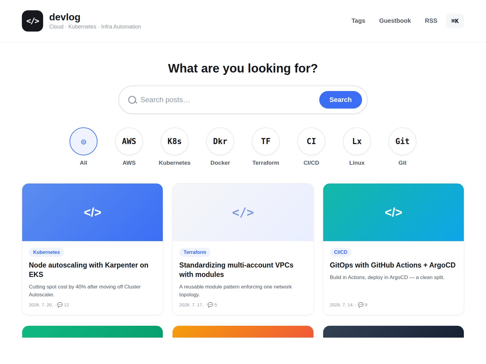

# 🏃‍♂️🍽️ 달리고 먹고 — Tistory Blog Skin

러닝 코스 · 맛집 · 제품리뷰를 기록하는 블로그를 위한 티스토리 스킨입니다.
**애플워치 기록(TCX)만 올리면 지도가 자동으로 그려지고**, 마크다운으로 쓴 글이 알아서 예쁘게 정리됩니다.



---

## ⭐ 무엇이 되나요

| | |
| --- | --- |
| 🗺️ **캔버스 러닝 맵** | 달린 코스가 지도 위에 그려집니다. 드래그·핀치로 움직이고, 거리에 따라 색이 달라집니다. |
| 📦 **TCX 자동 파이프라인** | 활동 파일을 끌어다 놓으면 거리·페이스·심박·케이던스·난이도·지역을 자동 계산합니다. (GPX 도 지원) |
| 📝 **마크다운 최적화** | 표는 카드로, 인용구는 콜아웃으로, 연속된 사진은 갤러리로 바뀝니다. |
| 🔗 **코스 ↔ 맛집 자동 연결** | 좌표만 있으면 글 아래에 근처 맛집(또는 근처 코스)이 자동으로 붙습니다. |
| 📑 **자동 목차 · 읽기 진행률** | 제목이 3개 이상이면 목차가 생기고, 상단에 진행률 바가 표시됩니다. |
| 📱 **모바일 대응** | 표는 카드로 접히고, 지도는 두 손가락으로 조작합니다. |

---

## 📁 파일 구성

```
skin.html              티스토리 스킨 HTML
style.css              스타일
index.xml              스킨 정보
images/
  ├─ map.js            지도 엔진 (렌더링 · 줌 · 팬 · 애니메이션)
  ├─ script.js         UI + 마크다운 본문 꾸미기
  ├─ mapData.js        손으로 관리하는 맛집 목록 (선택)
  ├─ courses.json      ★ 코스 데이터 — 도구가 자동 생성
  ├─ korea.json        대한민국 행정구역 외곽선
  ├─ rivers.json       주요 강줄기
  └─ parks.json        공원 · 호수
tools/
  ├─ build-post.mjs    ★ TCX + 사진 + 소감 → 글 초안 한 번에 (아래 참고)
  ├─ gpx-studio.html   ★ TCX/GPX 끌어다 놓기 → courses.json 만들기 (브라우저)
  ├─ build-courses.mjs ★ gpx/*.tcx → courses.json (명령어)
  ├─ tcx-core.mjs      ★ TCX 파서 (기기 거리 · 심박 · 케이던스 · 활동 분류)
  ├─ tcx-report.mjs    ★ TCX 묶음 분석 — 글감이 될 러닝 골라내기
  ├─ gpx-core.mjs      변환 공용 로직 (거리 · 페이스 · 스플릿 · 폴리라인)
  ├─ photo-prep.mjs    사진 리사이즈 · EXIF 제거 · 커버 후보 선정
  ├─ exif.mjs          최소 EXIF 리더 (촬영 시각 · 회전 · GPS)
  ├─ drive-import.mjs  구글 드라이브에서 받은 사진 → 러닝 폴더 (날짜로 거르기)
  ├─ build-studio.mjs  gpx-core 를 스튜디오에 인라인
  └─ preview.mjs       업로드 전 로컬 미리보기 생성
templates/             글 양식 (러닝코스 · 맛집 · 제품리뷰)
gpx/                   GPX 파일을 넣는 폴더 (지도 데이터만 갱신할 때)
runs/                  ★ 러닝 한 번치 재료 (TCX · 사진 · 소감)
posts/                 ★ 만들어진 글 초안 + 가공된 사진
```

---

## 🔧 설치

### 1. 스킨 올리기

1. 티스토리 **관리 → 꾸미기 → 스킨 편집 → html 편집**
2. `skin.html` 내용을 전부 붙여넣기
3. **CSS** 탭에 `style.css` 내용을 전부 붙여넣기
4. **파일 업로드** 탭에서 `images/` 안의 파일을 모두 올리기
   - `map.js` `script.js` `mapData.js` `courses.json`
   - `korea.json` `rivers.json` `parks.json`
5. 저장

> ⚠️ 티스토리는 업로드한 파일을 모두 `./images/` 아래에서 제공합니다.
> 폴더 구조 없이 파일만 올리면 됩니다.

### 2. 카테고리 만들기

스킨 메뉴가 아래 이름을 기준으로 동작합니다. 똑같은 이름으로 만들어 주세요.

- `러닝코스` · `맛집` · `제품리뷰`

다른 이름을 쓰려면 `skin.html` 의 메뉴 링크와 `images/script.js` 의 `CATEGORY_URLS` 를 함께 바꾸세요.

---

## 🗺️ GPX → 지도 (핵심 기능)

매번 좌표를 손으로 적을 필요가 없습니다. 두 가지 방법 중 편한 걸 쓰세요.

### 방법 A — 브라우저에서 (설치 불필요, 추천)

1. `tools/gpx-studio.html` 을 더블클릭해 엽니다.
2. 러닝 앱에서 받은 **GPX 파일을 끌어다 놓습니다.** (여러 개 한 번에 가능)
3. 거리 · 시간 · 페이스 · 상승고도 · 난이도 · 지역이 자동으로 계산됩니다.
4. 코스 이름과 글 주소만 확인하고 **`courses.json` 내려받기** 를 누릅니다.
5. 티스토리 **스킨 편집 → 파일 업로드** 에 `courses.json` 을 올립니다. 끝.

같은 화면에서 **글에 붙여넣을 마크다운 표**도 함께 만들어 줍니다.

### 방법 B — 명령어로 (여러 개를 한 번에)

```bash
# 1. gpx/ 폴더에 .gpx 파일을 넣고
node tools/build-courses.mjs
```

- `images/courses.json` 이 만들어집니다.
- `gpx/out/<아이디>.md` 에 글에 붙여넣을 표가 생깁니다.
- 글 주소·제목을 고정하려면 `gpx/meta.json` 을 쓰세요. ([자세히](gpx/README.md))
- 이미 적어둔 `link` 값은 다시 빌드해도 유지됩니다.

### 활동 파일은 어디서 받나요

| 앱 | 경로 | 형식 |
| --- | --- | --- |
| **애플 워치 (건강 앱)** | **RunGap** → Dropbox 자동 업로드 | **TCX** |
| 가민 커넥트 | 활동 상세 → 우측 톱니 → 내보내기 | TCX · GPX |
| 스트라바 | 활동 페이지 → `...` → Export | GPX |
| 삼성 헬스 | 웹 → 데이터 다운로드 | GPX |

> TCX 를 권합니다. GPX 에는 없는 **기기가 측정한 거리 · 심박 · 케이던스 · 칼로리**가 들어 있습니다.
> GPS 좌표로 계산한 거리는 실제보다 짧게 나옵니다.

### 좌표는 어떻게 저장되나요

GPX 의 수천 개 좌표를 **Encoded Polyline** 으로 압축하고, 화면에 보이지 않을
정도의 점은 걸러냅니다. 코스 3개가 약 2KB 입니다 — 지도가 느려지지 않습니다.

---

## ⚡ 글 초안 자동 생성 (추천)

TCX 와 사진, 소감만 있으면 글의 뼈대가 통째로 만들어집니다. **사진 순서도 신경 쓰지 않아도 됩니다.**

```bash
npm install                                   # 최초 1회 (사진 가공용 sharp)
node tools/build-post.mjs runs/2026-09-21-여의도
```

```
runs/2026-09-21-여의도/          →     posts/2026-09-21-여의도-한강공원-5k/
  activity.tcx                            post.md       ← 글 초안
  IMG_0001.jpg ... IMG_0008.jpg           data.json     ← 계산 결과
  notes.md                                photos/       ← 1600px · EXIF 제거됨
```

무엇을 해주나요:

| | |
| --- | --- |
| 📏 **숫자 자동 계산** | 거리 · 시간 · 평균 페이스 · 상승고도 · 난이도 · 지역 · **1km 구간 스플릿** |
| ❤️ **워치 기록** | TCX 면 **심박 · 케이던스 · 칼로리**가 정보 표에 자동으로 들어갑니다 |
| 📸 **사진 자동 배치** | 촬영 시각과 트랙 시각을 맞춰 **사진이 코스 몇 km 지점인지** 계산하고 제자리에 넣습니다 |
| 🔒 **위치정보 제거** | 사진의 EXIF GPS 를 지웁니다 — 집 근처 러닝 사진에서 사는 곳이 새지 않도록 |
| 🖼️ **사진 호스팅** | 1600px 로 줄여 저장소에 두고 jsDelivr CDN 주소를 글에 박습니다 |
| 🗺️ **지도 연결** | `images/courses.json` 을 갱신하고 본문에 `[course:아이디]` 를 넣습니다 |

사진은 **찍은 시각으로** 자리를 찾아갑니다.

- 달리기 **전**에 찍은 사진 → `🅿️ 주차 & 출발 지점`
- 달리는 **중** → `🏃 코스 따라가기` 의 해당 km 구간
- 완주 **후** → `📸 러닝 기록`

남는 일은 `post.md` 의 `<!-- WRITE: ... -->` 를 채우는 것뿐입니다. 숫자와 사진은 이미 다 맞춰져 있습니다.

쌓인 활동 중에 어떤 게 글감이 되는지 먼저 보려면:

```bash
node tools/tcx-report.mjs <TCX 폴더> --runs
```

자세한 사용법은 [`runs/README.md`](runs/README.md) 와 [`posts/README.md`](posts/README.md) 를 보세요.

> ⚠️ 글을 발행하기 전에 **사진이 `main` 에 푸시돼 있어야** CDN 주소가 살아납니다.

> 💡 발행 자체를 자동화하는 건 [TODO.md](TODO.md) 에 정리해 뒀습니다.
> 티스토리 Open API 가 2024년에 종료돼서 브라우저 자동화 외에는 방법이 없습니다.

---

## ✍️ 글쓰기 — 손으로 쓸 때

러닝코스 글 하나를 쓰는 전체 흐름입니다. 익숙해지면 10분이면 끝납니다.

```
📸 사진 찍기  →  📥 GPX 내보내기  →  🔄 courses.json 갱신
              →  ✍️ 마크다운으로 쓰기  →  🏷️ 카테고리·태그  →  🚀 발행  →  🔗 글 주소 연결
```

### Step 1 — 달리면서 사진 찍기

양식에 사진 자리가 미리 정해져 있습니다. 이 순서대로 찍어두면 나중에 고민할 게 없습니다.

| 순서 | 무엇을 | 왜 필요한지 |
| --- | --- | --- |
| 1 | 주차장 입구 · 요금 안내판 | 러너가 가장 먼저 검색하는 정보입니다 |
| 2 | 지하철 출구 · 공원 진입로 | 대중교통으로 오는 사람용 |
| 3 | 출발 지점에서 바라본 코스 | 코스 첫인상 |
| 4~6 | 구간별 풍경 2~3장 | `코스 따라가기` 섹션에 들어갑니다 |
| 7 | 급수대 · 화장실 | 있고 없고가 코스 선택을 좌우합니다 |
| 8 | 워치 기록 화면 | 거리 · 페이스 근거 |

### Step 2 — GPX 내보내고 지도 데이터 갱신

1. 러닝 앱에서 GPX 내보내기 ([앱별 방법](#gpx-파일은-어디서-받나요))
2. `tools/gpx-studio.html` 을 열고 **GPX 를 끌어다 놓기**
3. **⬇️ courses.json 내려받기** → 티스토리 [스킨 편집 → 파일 업로드] 에 올리기
4. 같은 화면의 **📝 이 코스 마크다운** 버튼으로 코스 정보 표를 복사해 둡니다

### Step 3 — 티스토리에서 마크다운으로 쓰기

1. **글쓰기** → 오른쪽 위 에디터 모드에서 **마크다운** 선택
2. [`templates/러닝코스.md`](templates/러닝코스.md) 내용을 전부 붙여넣기
   (Step 2 에서 복사한 표가 있으면 코스 정보 부분은 그걸로 대체하세요)
3. 표 안의 값만 실제 정보로 바꾸기

> ⚠️ 마크다운으로 쓴 글을 나중에 기본모드로 바꾸면 서식이 깨집니다. 한 번 정했으면 그대로 두세요.
>
> ⚠️ 표 · 목록 · 인용구 **앞뒤에는 빈 줄**을 넣어야 제대로 인식됩니다.

### Step 4 — 사진 넣기

마크다운 모드에서 사진을 드래그하면 `` 가 자동으로 들어갑니다.
**대괄호 안에 설명을 적으면 사진 아래 캡션**이 됩니다.

```markdown


```

이렇게 **빈 줄 없이 붙여 쓴 사진 2장 이상**은 자동으로 갤러리 그리드가 되고,
클릭하면 크게 볼 수 있습니다.

### Step 5 — 카테고리 · 태그 · 대표 이미지

| 항목 | 설정 |
| --- | --- |
| 카테고리 | `러닝코스` · `맛집` · `제품리뷰` 중 하나 — 이름이 정확해야 메뉴와 배지 색이 맞습니다 |
| 태그 | **첫 번째 태그를 지역명으로** — `여의도`, `올림픽공원` 처럼 |
| 대표 이미지 | 목록 카드의 썸네일이 됩니다. 코스 전경 사진을 추천합니다 |

첫 태그를 지역명으로 두면 좌표가 아직 없어도 글 아래에 `○○ 맛집` 검색 링크가 붙습니다.

### Step 6 — 발행하고 글 주소를 코스에 연결

발행하면 글 주소가 생깁니다. 이 주소를 코스에 연결해야 **지도에서 코스를 눌렀을 때 글로 이동**합니다.

| 주소창에 보이는 것 | `link` 에 적을 값 |
| --- | --- |
| `https://내블로그.tistory.com/12` | `/12` |
| `https://내블로그.tistory.com/entry/여의도-한강-5k` | `/entry/여의도-한강-5k` |

> 카테고리 경로(`/category/러닝코스/12`)는 글 주소가 아닙니다. 주소창에 실제로 찍히는 값을 쓰세요.

연결하는 방법은 둘 중 편한 쪽으로:

- **스튜디오** — `gpx-studio.html` 아래 `courses.json` 칸에 기존 내용을 붙여넣고
  **↩️ 기존 내용 불러오기** → `글 주소` 칸을 채우고 다시 내려받아 업로드
- **명령어** — `gpx/meta.json` 에 적고 `node tools/build-courses.mjs` 재실행
  (한 번 적어두면 다음 빌드부터는 자동으로 유지됩니다)

> 건너뛰어도 됩니다. 비워두면 코스를 눌렀을 때 **제목으로 블로그 내 검색**이 열립니다.

---

### 🍽️ 맛집 글 쓰기

1. [`templates/맛집.md`](templates/맛집.md) 붙여넣기
2. **좌표 얻기** — 구글 지도에서 가게 위치를 **우클릭 → 맨 위의 숫자를 클릭하면 복사**됩니다
   (`37.5265, 126.9315` → 앞이 위도(lat), 뒤가 경도(lon))
3. `gpx-studio.html` 아래쪽 **🍽️ 맛집** 표에
   이름 · 글 주소 · 위도 · 경도 · 한 줄 소개를 넣고 `courses.json` 을 다시 업로드

등록하면 이렇게 동작합니다.

- 지도에 🍽️ 핀이 찍히고, 눌러서 글로 이동
- **5km 이내 러닝코스 글** 아래에 이 맛집이 자동 추천
- **이 맛집 글** 아래에 근처 러닝 코스가 자동으로 표시

맛집만 몇 개 추가할 때는 `images/mapData.js` 에 직접 적고 그 파일만 올려도 됩니다.

### 📦 제품리뷰 글 쓰기

[`templates/제품리뷰.md`](templates/제품리뷰.md) 를 붙여넣고 표와 별점만 채우면 됩니다.
지도 · 좌표와는 무관해서 GPX 작업이 필요 없습니다.

---

### 스킨이 알아서 바꿔주는 것들

| 마크다운 | 결과 |
| --- | --- |
| `## 📍 코스 정보` + `\| 항목 \| 내용 \|` 표 | 아이콘이 붙은 **정보 카드** |
| `★★☆☆☆` | 별점 위젯 |
| `> 💡 …` `> ⚠️ …` `> 🅿️ …` `> 🚇 …` `> ✅ …` `> 📌 …` `> 🍽️ …` | 색이 다른 **콜아웃 박스** |
| 빈 줄 없이 연달아 쓴 이미지 2장 이상 | **갤러리 그리드** (클릭하면 크게) |
| `` 의 대괄호 안 | 사진 아래 **캡션** |
| `[course:아이디]` | 그 자리에 **코스 지도** |
| ` ```bash ` 코드 블록 | 언어 배지 + **복사 버튼** |
| `- [x]` / `- [ ]` | 체크리스트 |
| `##` 제목 3개 이상 | 글 맨 위 **자동 목차** + 상단 읽기 진행률 |

### 자주 쓰는 조각 모음

```markdown
> 🅿️ **주차 팁** — 주말 오전 9시 넘으면 1주차장이 꽉 찹니다.
> 🚇 **대중교통** — 5호선 여의나루역 2번 출구 도보 5분.
> 💡 **팁** — 급수대는 겨울에 잠겨 있을 때가 있어요.
> ⚠️ **주의** — 주말 오후는 산책 인파가 많습니다.
> ✅ **또 올까요?** — 네, 페이스 훈련하러 자주 올 것 같습니다.

- [x] 러닝 입문자에게 추천
- [ ] 언덕 훈련에는 부적합

| 항목 | 평가 |
| --- | --- |
| 난이도 | ★★☆☆☆ |
```

### 코스 ↔ 맛집 자동 연결 정리

`images/courses.json` 에 좌표가 들어 있으면 **글에 아무것도 안 써도** 연결됩니다.

| 글 종류 | 자동으로 붙는 것 | 조건 |
| --- | --- | --- |
| 러닝코스 | 근처 맛집 | 코스 중간 지점에서 5km 이내 |
| 맛집 | 근처 러닝 코스 | 그 맛집에서 5km 이내 |
| 좌표 없음 | 첫 태그로 검색 링크 | 태그가 1개 이상 |

---

## 👀 올리기 전에 미리 보기

```bash
node tools/preview.mjs
python3 -m http.server 8777
```

→ <http://localhost:8777/preview/> 에서 홈 · 글 · 목록 화면을 확인할 수 있습니다.

> `file://` 로 열면 브라우저가 JSON 로딩을 막아 지도가 나오지 않습니다. 꼭 서버로 여세요.

---

## 🎨 커스터마이징

`style.css` 맨 위의 CSS 변수만 바꾸면 전체 색이 바뀝니다.

```css
:root {
    --primary: #ff6b4a;          /* 메인 색 */
    --primary-light: #ff9a76;
    --primary-dark: #e5553a;

    --cat-running: #2ecc71;      /* 카테고리 배지 색 */
    --cat-food: #ff9800;
    --cat-review: #42a5f5;

    --bg: #faf9f7;               /* 배경 */
    --maxw: 1160px;              /* 본문 최대 폭 */
    --radius: 16px;              /* 모서리 둥글기 */
}
```

지도 색과 거리 구간은 `images/map.js` 맨 위 `CONFIG` 에서 바꿉니다.

```js
tiers: [
    { max: 5,        core: '#37c98a', … },   // 5km 미만 — 초록
    { max: 10,       core: '#3d8bff', … },   // 5~10km  — 파랑
    { max: Infinity, core: '#ff6b4a', … }    // 10km 이상 — 주황
]
```

---

## 🗺️ 지도 조작

| | 데스크톱 | 모바일 |
| --- | --- | --- |
| 이동 | 드래그 | 두 손가락 |
| 확대/축소 | 지도 클릭 후 스크롤, 또는 `Ctrl(⌘)` + 스크롤 | 두 손가락 핀치 |
| 코스 열기 | 코스 클릭 | 탭 → 한 번 더 탭 |
| 내 위치 | 🎯 버튼 | 🎯 버튼 |

> 페이지 스크롤을 뺏지 않도록, 지도 위에서의 한 손가락/기본 스크롤은 **페이지 스크롤**로 동작합니다.

브라우저 콘솔에서 `window.RunMap` 으로 지도를 직접 제어할 수도 있습니다.

---

## ❓ FAQ

**지도가 안 보여요**
`korea.json` 이 업로드됐는지 확인하세요. 지도 영역에 오류 메시지가 표시됩니다.
홈 화면(`tt-body-index`)에서만 지도가 나옵니다.

**코스를 눌러도 글로 안 가요**
`courses.json` 의 `link` 가 비어 있으면 제목으로 블로그 내 검색이 열립니다.
글을 발행한 뒤 스튜디오나 `gpx/meta.json` 에 글 주소를 넣어 주세요.
`link` 는 **주소창에 실제로 찍히는 경로**여야 합니다 — `/12` 또는 `/entry/제목`.
카테고리 경로(`/category/러닝코스/12`)를 적으면 연결되지 않습니다.

**글에 지도가 안 나와요**
글 주소(`link`)나 제목이 코스와 맞아야 자동으로 붙습니다.
확실히 하려면 본문에 `[course:아이디]` 한 줄을 넣으세요.
아이디는 스튜디오의 `아이디 (지도 연결용)` 칸에서 확인할 수 있습니다.

**표가 카드로 안 바뀌어요**
제목이 `코스 정보` · `기본 정보` · `가게 정보` · `제품 정보` · `스펙` 중 하나인지,
표가 2줄 이상인지 확인하세요.

**마크다운으로 썼는데 표나 목록이 깨져요**
표 · 목록 · 인용구 앞뒤에 빈 줄이 있는지 확인하세요.
글을 쓰는 중에 기본모드로 전환하면 마크다운 서식이 사라집니다.

**GPX 를 고쳤는데 지도가 그대로예요**
`courses.json` 을 다시 업로드한 뒤, `skin.html` 의 `?v=8` 숫자를 올려 캐시를 비우세요.

---

## 📜 라이선스

MIT License — 자유롭게 쓰고 고치셔도 됩니다.
